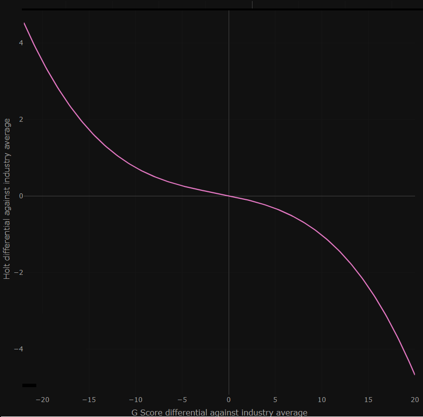
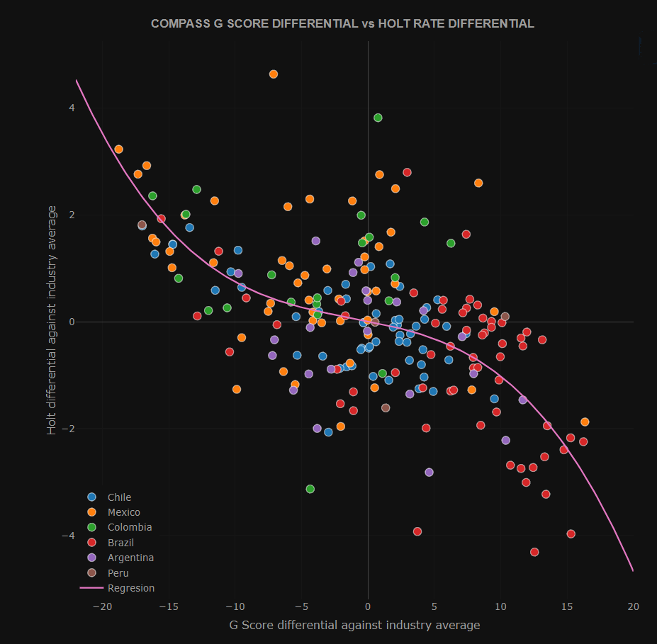

##  ESG Scores in Latin American Markets 

**Introduction:** 
Latin America is an emergent focus for inversion and innovation. The idea that countries are still young tells that many things
are left to do and to exploit, making it an interesting point for economic growth. Although all this good inversions opportunities, 
Latin America is branded as an irregular market. The diverse problems like social outbreaks, corruption, government instability, environmental damage, etc;
give the investors less trust to put there money in Latin America stocks. But as it's say, the bigger the risk the bigger the reward. For this reason is vital to analyse all the companies under different scopes, being environmental, social and corporate governance (ESG) the most relevant ones. The goal of this project is make the analysis under this three aspects for more than 100 Latin American companies, see how they affect in there discount rate and relate on the return of a company or certain type of industry.

**Methods and Materials:**
This project requires knowledge in big data, financials and econometrics. 
To analyse the return of a company the discount rate has to be calculated. HOLT employs a total system approach to measuring and forecasting corporate returns (for more information see <a href="https://onlinelibrary.wiley.com/doi/10.1002/9781119440512.ch7">Beyond Earnings</a>). In this project the HOLT discount rate for every company is taken from _Credit Suisse_. 

All the code was implement in Python. 

**Development:**
ESG refers to the three central factors in measuring the sustainability and societal impact of an investment in a company or business.
These criteria help to better determine the future financial performance of companies, return and risk. We made a questionnaire of 101 multiple choice questions related to ESG and we make all the analysts to answer it for every company that trades in the stock market of Latin America. We determine a ESG score with the next equeation:

Where __x__ is the answer of the question n and __w__ is the weight of that question. The __x__ value is assigned depending on the answer and it takes values between 0 and 1. The weight will be calculated through an optimisation model that it will be explained later.
Making a simple assumption that for a high ESG score, the lower the HOLT will be. This in general is true, companies that have better behavior, the market will reward with a better revenue, or in other words, with a lower discount rate. The fucntion that explain this: 

Where betas are the coefficients of a three order equation to predict a HOLT value given a ESG score. Graficaly this looks like:

Caption: Curve to fit all the observed points. 

This assumption make sense, because for companies with a great ESG score I'll expect a good return (lower HOLT) and with a awful ESG score the market will punish the companies, expecting a bad return (higher HOLT). So in the extremes is comprensible that either it rewards with a good discount rate or punish it with a bad one with more intensity. With a regular score the differenc in return is not so radical. Is necessary to compare the predicted HOLT with the real or observed ones given by _Credit Suisse_. Now we can determine the __w__ weights calculating the minimum coefficient of determination _R square_. The optimization equation should look like: 

Is important to note that every industry is different from each other, so we take the mean of every industry __i__ to compare the companies. The industry type can be: Utilities, Industrials, Consumer Staples, Materials, Consumer Discretionary, Communication Service, Financials, Real State, Energy, Health Care and Information Technology.

**Results:**
Determine the weitghts of every question will tell us which question is more importatn in the moment to take a desicion or make analysis of a companie. After the optimisation model many question give they weights to 0. The minumim value for the coefficient of determination was __R square = 0.32__. Next is show the ESG scores of companies form different countries fitted to the curve. 

Caption: Results of ESG scores vs HOLT value. 

**Conclusion:**
Nowadays people are very aware of what companies are doing, if they are frendly to the enviroment, or if the labor conditions are acceptable.

_(Agust, 2019) Compass Group Asset Management, Santiago, Chile.  
All the intellectual property of this project belongs to Compass Group Asset Management._
